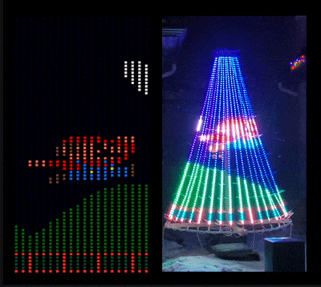
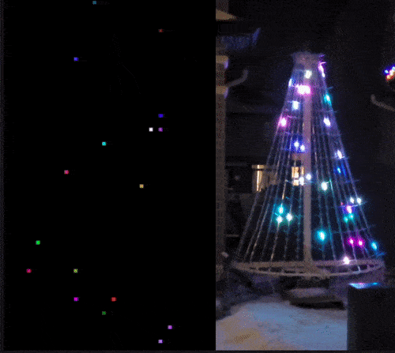

# Rusty Christmas Tree

This is code that draws on the LED Christmas Tree made by
[@aidancrowther](https://github.com/aidancrowther/). You can see his 3D design
files and Pi Pico setup code on his project
[OpenPixelTree](https://github.com/aidancrowther/OpenPixelTree).

<p align="center">
    
</p>

## Adding your own renderer

Write your own code to run on the tree, you need to implement a renderer. You
can find the renderers in [this
folder](https://github.com/AngelOnFira/rusty-christmas-tree/tree/main/tree-writer/src/renderers).
To add a new one, start by duplicating the `template` folder and giving it a new
name. You'll then have to add code in several different places in the project:

- First, add your module
  [here](https://github.com/AngelOnFira/rusty-christmas-tree/blob/main/tree-writer/src/renderers/mod.rs#L5).
- Second, add a new enum variant
  [here](https://github.com/AngelOnFira/rusty-christmas-tree/blob/main/tree-data-schema/src/lib.rs#L7).
- Next, we'll have to add this new variant to several match statements
  [here](https://github.com/AngelOnFira/rusty-christmas-tree/blob/main/tree-data-schema/src/lib.rs#L17),
  [here](https://github.com/AngelOnFira/rusty-christmas-tree/blob/main/tree-writer/src/renderers/mod.rs#L13),
  and
  [here](https://github.com/AngelOnFira/rusty-christmas-tree/blob/main/tree-writer/src/main.rs#L54).
- Finally, set the default vizualizer renderer to your new renderer
  [here](https://github.com/AngelOnFira/rusty-christmas-tree/blob/main/tree-visualizer/src/main.rs#L38).
  
Hopefully I get some time to fix this eventually, but I don't know how right
now. Now, you can start working in the `mod.rs` file in the new renderer folder.

<p align="center">
    
</p>

## Architecture

### Physical Tree

The physical tree is running on a Raspberry Pi Pico. There are 20 (actually 19)
strips running, creating 19x75 LED grid. You send data to the LED strings using
`spidev`, and send 4500 8-bit numbers for each frame. 20 frames can be drawn per
second. The light indexes on the tree are as follows:

```
3 4 9
2 5 8
1 6 7
```

### tree-writer

This crate is where the different "renderers" are implemented. A renderer is
just a module that implements a draw function, and returns a `TreeCanvas`. In
this function, you can set any `Pixel{r: u8, g: u8, b: u8}` on the `TreeCanvas`.

### tree-visualizer

This crate uses [Nannou] to visualize different `renderers`. It renders at the
same speed (I think:tm:) and orientation that will be displayed on the tree.

### tree-backend

### tree-frontend

### tree-script

This was an attempt to use the Mun scripting language as the backend for drawing
to the canvas. Currently, this isn't working, but if an MVP is made, then it
could be easier to write with, and hot reloadable as well.

[Nannou]: https://github.com/nannou-org/nannou

<p align="center">
    
</p>